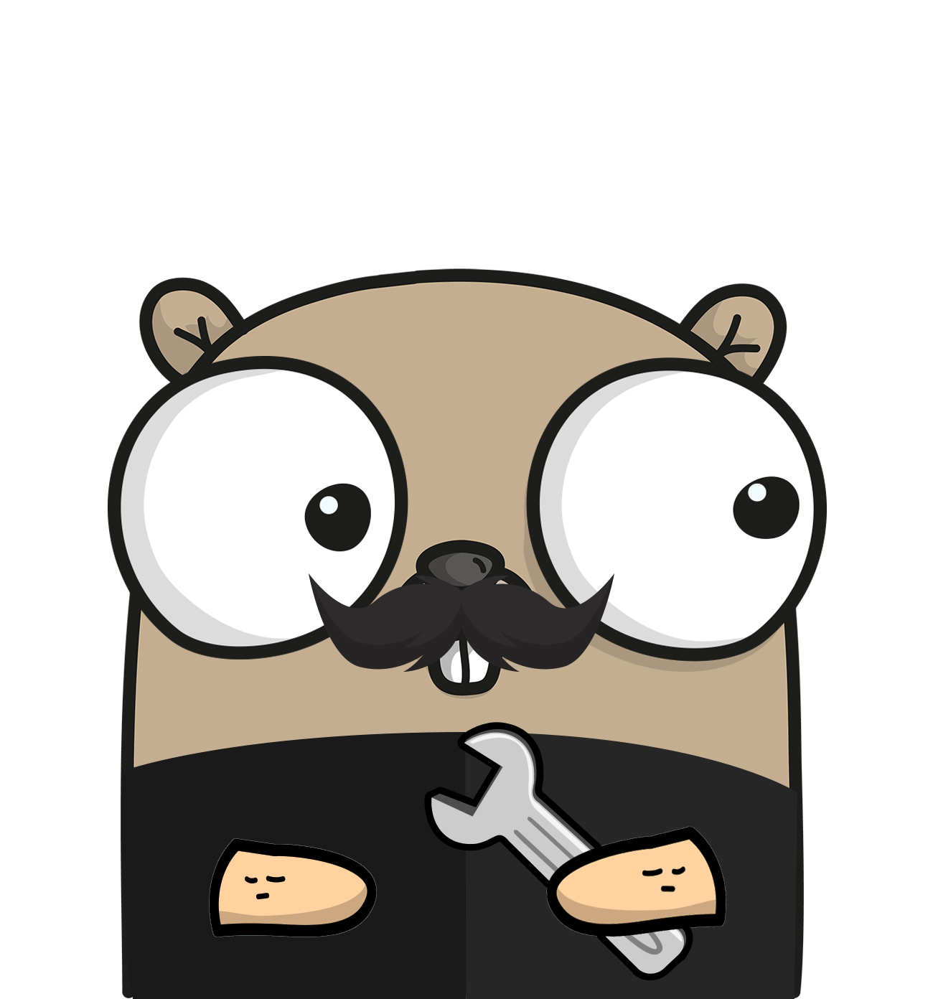

<p align="center"></p>

<h1 align="center">
  dm-go-ft
</h2>

# Como funciona
- A biblioteca se conecta em um banco de dados no redis para buscar feature toggles ou remote configs dos projetos.
- Estes valores serão então salvos na memória local, para então ser possível acessá-los de maneira rápida, sem utilizar recursos de infra.
- A biblioteca fica esperando quaisquer atualizações nos feature toggles do projeto, para atualizar a memória local quando necessário.

# Como usar
## instalação
```bash
go get github.com/delivery-much/dm-go-ft
```

## Configuração
A biblioteca deve ser instanciada através do método `Init`.
Este método receberá um objeto do tipo `Config`, com as informações necessárias para se conectar ao redis.

Ex.:
```go
import "github.com/delivery-much/dm-go-ft/featuretoggle"

...

err := featuretoggle.Init(featuretoggle.Config{
  Host: "MyHost",
  Port: "0303",
  DB: 1,
  ServiceName: "MyService",
})
```
o método `Init` retorna um erro caso falhe para conectar no redis.

> de preferência, o Init deverá ser chamado uma vez, ao subir do projeto.

## Uso
Após a biblioteca ter sido instanciada, pode-se chamar a biblioteca de qualquer ponto do código.
A biblioteca possui uma série de funções variadas para obter feature toggles:

### IsEnabled
Recebe dois parâmetros, a chave do redis, e um valor default.
Utiliza a chave para buscar um booleano no redis.
Utilizado para checar se uma feature toggle está habilitada.

retorna o valor default se:
- A conexão com o redis não estiver sido instanciada;
- O valor não for encotrado no redis usando a chave especificada;
- O valor encontrado não for um booleano;

Ex.:
```go
import "github.com/delivery-much/dm-go-ft/featuretoggle"

...

if featuretoggle.IsEnabled("MyKey", false) {
  // faz alguma coisa
}
```

### GetString
Recebe dois parâmetros, a chave do redis, e um valor default.
Utiliza a chave para buscar uma string no redis.
Utilizado normalmente para remote configs.

retorna o valor default se:
- A conexão com o redis não estiver sido instanciada;
- O valor não for encotrado no redis usando a chave especificada;
- O valor encontrado não for uma string;
- O valor encontrado for uma string vazia;

Ex.:
```go
import "github.com/delivery-much/dm-go-ft/featuretoggle"

...

if featuretoggle.GetString("MyKey", "MyDefaultValue") == "MyExpectedKey" {
  // faz alguma coisa
}
```

### GetNumber
Recebe dois parâmetros, a chave do redis, e um valor default.
Utiliza a chave para buscar um número inteiro de 64 bits no redis.
Utilizado normalmente para remote configs.

retorna o valor default se:
- A conexão com o redis não estiver sido instanciada;
- O valor não for encotrado no redis usando a chave especificada;
- O valor encontrado não for um número de 64 bits válido;

Ex.:
```go
import "github.com/delivery-much/dm-go-ft/featuretoggle"

...

if featuretoggle.GetNumber("MyKey", 5) <= 3 {
  // faz alguma coisa
}
```

### IsEnabledByPercent
Recebe a chave do redis.
1. Utiliza a chave para buscar uma porcentagem (um número inteiro entre 0 e 100);
2. Calcula um número aleatório entre 0 e 100;
3. Retorna um booleano indicando se o número calculado está dentro da porcentagem encontrada.

Geralmente utilizado para liberações graduais de features.

retorna `false` se:
- A conexão com o redis não estiver sido instanciada;
- O valor não for encotrado no redis usando a chave especificada;
- O valor encontrado não for uma porcentagem válida ((um número inteiro entre 0 e 100));
- O número calculado for maior do que a porcentagem indicada no valor encontrado.

retorna `true` se:
- o número calculado for menor ou igual a porcentagem indicada no valor encontrado.

Ex.:
```go
import "github.com/delivery-much/dm-go-ft/featuretoggle"

...

if featuretoggle.IsEnabledByPercent("MyKey") {
  // faz alguma coisa
}
```

## Utilizando a biblioteca nos testes
A biblioteca tem capacidade nativa para ser Mockada, para isto basta utilizar a função `Mock`.

Nesta função, será passado quais as chaves e valores específicas que devem estar presentes ao acessar as funções.
Tanto as chaves quanto os valores devem ser passados em formato de `string`, mesmo em casos de números.

É necessário apenas se atentar a uma particularidade da biblioteca de feature toggles:
Para cada feature toggle, deve haver seu valor, e seu tipo (`"number"`, `"string"` ou `boolean`), como no exemplo abaixo.

```go
featuretoggle.Mock(map[string]string{
  "MY_KEY": "my val",
  "MY_KEY.type": "string",
})
```

Desta forma, é possível especificar um comportamento para a biblioteca.
